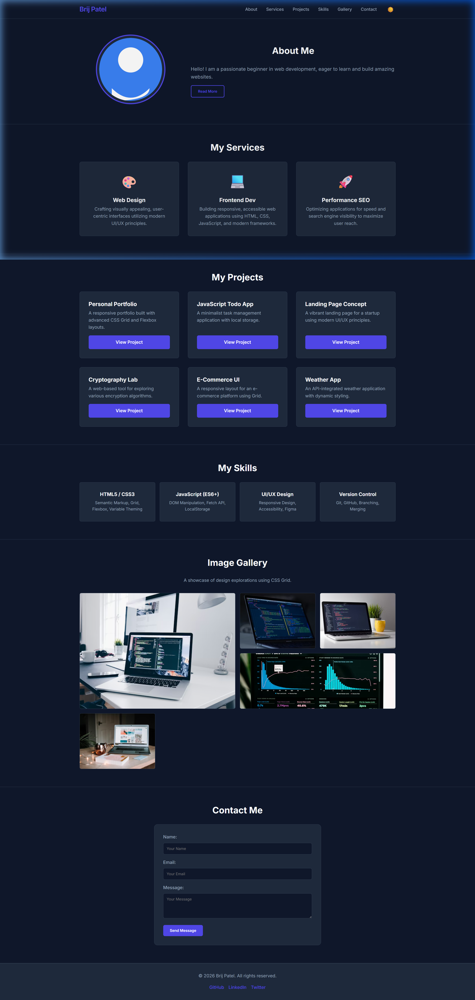
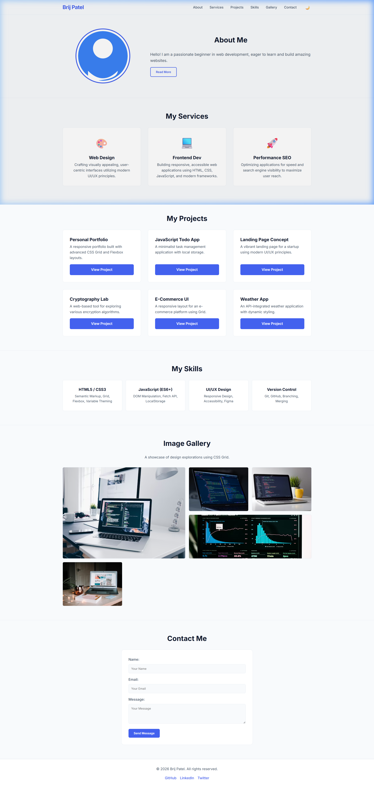

# Advanced Portfolio with CSS Grid & Javascript

## Project Overview
This project represents a fully functional, highly interactive, and responsive portfolio. It integrates fundamental layout structures (CSS Grid and Flexbox), robust theming capabilities (CSS variables), sophisticated interactions (DOM manipulation and animations), and standardized CSS paradigms (BEM). The latest update adds an advanced masonry-style CSS Grid Gallery and a multi-column Services layout.

## Setup Instructions
1.  **Clone or Download the Repository:** Obtain the project files to your local machine (`git clone`).
2.  **Open the Project:** Navigate to the project directory that contains `index.html`.
3.  **Launch the site:** Open `index.html` in your default web browser. For developers, a local server (like Live Server extension or `python -m http.server`) is recommended to prevent any strict MIME-type issues on deep assets, though not strictly required.

## Code Structure
The codebase follows a modular structure separated by concern:
-   `/index.html`: The semantic HTML layout, implementing BEM classes (`Block__Element--Modifier`).
-   `/css/`: The central stylesheet directory.
    -   `main.css`: Core design system, resets, and CSS variables (Theming anchors).
    -   `layout.css`: Structural Grid and Flexbox frameworks for each distinct section.
    -   `animations.css`: Keyframe definitions, transitions, and hover states.
-   `/js/`: Interactivity scripts.
    -   `theme-switcher.js`: Manages the Dark/Light mode toggle and its persistence via LocalStorage.
    -   `main.js`: Contains logic for form validation and DOM manipulation (e.g., Read More logic).
-   `/screenshots/`: Visual evidence of the application in various states. Includes `dark-mode.png` and `light-mode.png`.

## Visual Details

### Dark Theme Preview

### Light Theme Preview

## Technical Highlights
-   **CSS Layouts**: Relies heavily on Grid and Flexbox for native wrapping and positioning.
-   **Javascript Modules**: Independent scripts loaded sequentially, providing resilient user inputs.
-   **Methodology Practice**: Full adherence to BEM naming patterns for scalable UI engineering.
